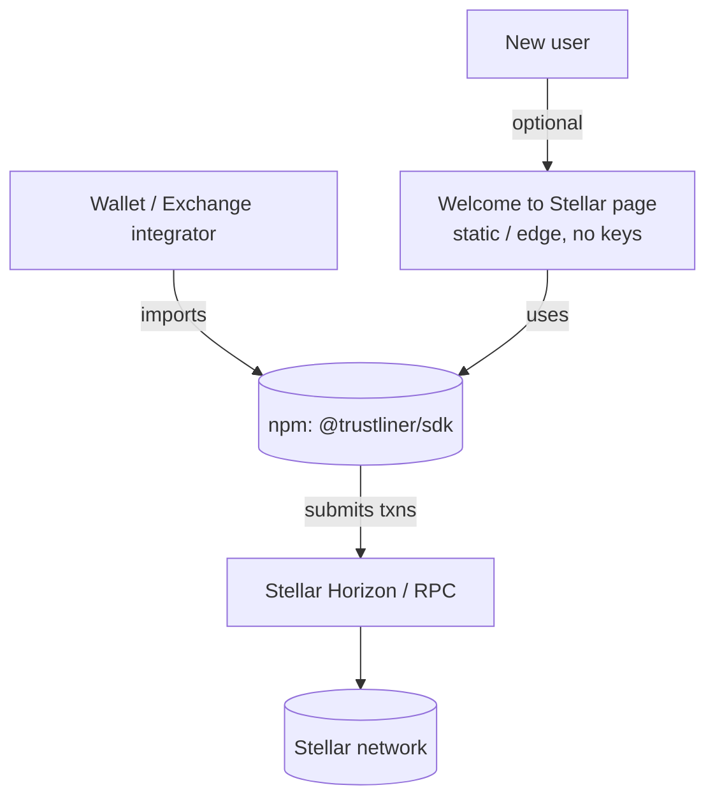

# Infrastructure

What the project runs on, as required by the RFP.

## Principle

Minimal, stateless, no key custody, no user-data store. The standard and SDK are static
artifacts; the onboarding flow executes against public Stellar infrastructure.

## Components

| Component | Runtime | State / keys |
| --- | --- | --- |
| Standard (SEP) | Markdown in repo / SEP registry | None |
| SDK | npm package, runs in caller's environment | None; caller signs |
| Reference implementation | Node.js CLI/scripts against public Horizon/RPC | None persistent |
| Landing page | Static / edge-rendered (Next.js) | No keys, no PII store |

## Network dependencies

- **Stellar Horizon / RPC** — public or self-hosted; the SDK is endpoint-agnostic.
- **Stellar network** — testnet for development, mainnet for production (latest stable
  release).

## Deployment topology

## Operational footprint

- No always-on backend is required for the core protocol.
- The landing page can run on any static/edge host.
- CI runs on GitHub Actions.
